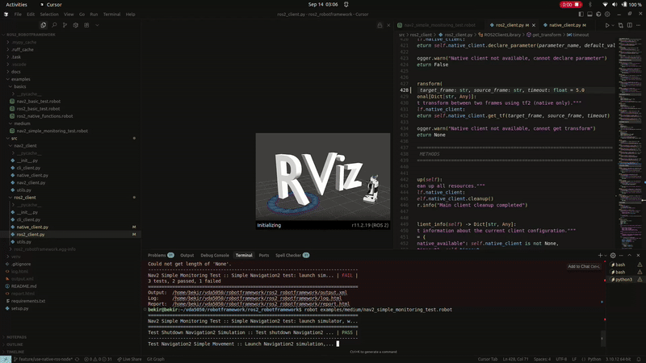

.. ROS2 RobotFramework documentation master file

Welcome to ROS2 RobotFramework's documentation!
================================================

A comprehensive Robot Framework library for testing and automating ROS2 applications.

.. toctree::
   :maxdepth: 2
   :caption: Getting Started

   installation
   quickstart
   examples/index

.. toctree::
   :maxdepth: 2
   :caption: User Guide

   user_guide/overview
   user_guide/ros2_operations
   user_guide/nav2_operations
   user_guide/advanced_usage
   user_guide/best_practices
   user_guide/troubleshooting

.. toctree::
   :maxdepth: 2
   :caption: API Reference

   api/ros2_client
   api/nav2_client
   api/cli_client
   api/native_client

.. toctree::
   :maxdepth: 1
   :caption: Development

   development/contributing
   development/changelog
   development/roadmap

.. toctree::
   :maxdepth: 1
   :caption: Additional Info

   license
   about

What is Robot Framework?
========================

**Robot Framework** is an open-source automation framework that uses keyword-driven testing with simple, readable syntax. It's perfect for ROS2 because:

.. panels::
   :container: +full-width text-center
   :column: col-lg-4 col-md-6 col-sm-12

   .. panel::
      :body:

      **🔧 Keyword-Driven**
      
      Complex ROS2 operations become simple keywords (`Navigate To Pose`, `Wait For Topic`)

   .. panel::
      :body:

      **📊 Rich Reporting**
      
      Built-in HTML reports with detailed logs for debugging

   .. panel::
      :body:

      **🔄 CI/CD Ready**
      
      Seamlessly integrates with automated testing pipelines

   .. panel::
      :body:

      **👥 Accessible**
      
      Non-programmers can write and understand test cases

   .. panel::
      :body:

      **🧪 System Testing**
      
      Ideal for testing complex multi-node ROS2 systems

   .. panel::
      :body:

      **📚 Learn More**
      
      `Robot Framework Documentation <https://robotframework.org/>`_

Key Features
============

.. tabs::

   .. tab:: Core ROS2 Operations

      - **Topic Operations**: List topics, get topic info, echo messages, publish messages, wait for topics
      - **Service Operations**: List services, call services, get service info, wait for services
      - **Node Operations**: List nodes, get node info, wait for nodes
      - **Parameter Operations**: List, get, set parameters, check parameter existence
      - **Launch Operations**: Launch files and packages, find launch files, manage launch processes
      - **Run Operations**: Run nodes directly, run with remapping, find executables, manage node processes

   .. tab:: Native ROS2 Python Node Operations

      - **Native Topic Operations**: Direct publishing/subscribing using ROS2 Python nodes
      - **Native Service Operations**: Direct service calls using ROS2 Python service clients
      - **Native Parameter Operations**: Direct parameter access using ROS2 Python parameter clients
      - **Native TF2 Operations**: Direct transform operations using ROS2 Python TF2
      - **Message Storage**: Automatic message buffering and retrieval
      - **Real-time Communication**: Low-latency, high-performance ROS2 communication

   .. tab:: Navigation2 Features

      - **Navigation2 Client**: Complete Navigation2 client with native ROS2 operations
      - **Navigate to Pose**: Point-to-point navigation with action client
      - **Navigate Through Poses**: Multi-waypoint navigation
      - **Costmap Operations**: Global and local costmap clearing
      - **Pose Management**: Initial pose setting and AMCL pose monitoring
      - **Velocity Control**: Direct velocity command publishing
      - **Navigation Status**: Real-time navigation status monitoring
      - **Recovery Behaviors**: Navigation recovery and error handling

Quick Example
=============

.. code-block:: robot

   *** Settings ***
   Library    ROS2ClientLibrary    use_native_node=True

   *** Test Cases ***
   Test Basic ROS2 Operations
       # List available topics
       ${topics}=    List Topics
       Log    Available topics: ${topics}
       
       # Check if a specific topic exists
       ${exists}=    Topic Exists    /chatter
       Should Be True    ${exists}
       
       # Get topic information
       ${info}=    Get Topic Info    /chatter
       Log    Topic info: ${info}

   Test Native ROS2 Operations
       # Subscribe to a topic using native ROS2 node
       ${success}=    Native Subscribe Topic    /chatter    std_msgs/msg/String
       Should Be True    ${success}
       
       # Publish a message using native ROS2 node
       ${success}=    Native Publish String    /chatter    "Hello World!"
       Should Be True    ${success}
       
       # Wait for and get the message
       ${message}=    Native Wait For Message    /chatter    timeout=5.0
       Should Not Be None    ${message}
       Log    Received: ${message}[data]

Tested with Navigation2
========================

This library has been extensively tested with Navigation2 applications. For testing and validation purposes, we used the following repository:

**Test Repository**: `navigation2_ignition_gazebo_turtlebot3 <https://github.com/Onicc/navigation2_ignition_gazebo_turtlebot3>`_

.. panels::
   :container: +full-width text-center
   :column: col-lg-3 col-md-6 col-sm-12

   .. panel::
      :body:

      ✅ **Basic Navigation**
      
      Point-to-point navigation tasks

   .. panel::
      :body:

      ✅ **Obstacle Avoidance**
      
      Dynamic obstacle detection and avoidance

   .. panel::
      :body:

      ✅ **Path Planning**
      
      Global and local path planning algorithms

   .. panel::
      :body:

      ✅ **Recovery Behaviors**
      
      Navigation recovery and error handling

   .. panel::
      :body:

      ✅ **Multi-robot Scenarios**
      
      Testing with multiple robot instances

.. note::
   While extensively tested with this specific repository, the library is designed to work with **any ROS2 project** and can be used with any ROS2-based robotic system, including custom robots, different navigation stacks, and various simulation environments.

Indices and tables
==================

* :ref:`genindex`
* :ref:`modindex`
* :ref:`search`
